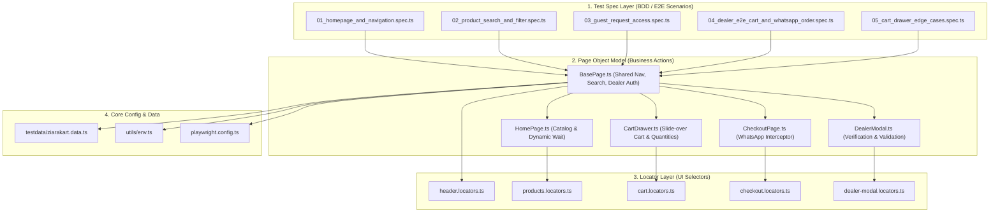
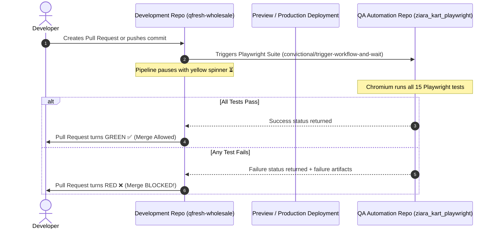

# ZiaraKart Playwright Automation Framework (TypeScript + POM)

[](https://github.com/Aquil1401/ziara_kart_playwright/actions/workflows/playwright.yml)


[](https://ziarakart.vercel.app/)

A scalable, maintainable, and enterprise-grade UI automation framework built for **[ZiaraKart](https://ziarakart.vercel.app/)** (Jharkhand's Smart Wholesale FMCG Hub) using **Playwright + TypeScript**.

Follows strict **Page Object Model (POM)** architecture, clean locator separation, sensitive credentials management, failure-only screenshot and video captures, and automated cross-repository GitHub Actions CI/CD regression gates.

---

## 🚀 Key Framework Features

- **Page Object Model (POM)**: Decoupled page actions, assertions, and locators.
- **Dynamic Loading Resilience**: Automatically accommodates client-side catalog rendering and network latency without brittle hardcoded timeouts.
- **Role-Based Testing**: Covers both **Guest Mode** (blurred prices, Request Access modal, input validation) and **Dealer Mode** (unblurred prices, Add to Cart, quantity adjustments).
- **End-to-End WhatsApp Order Integration**: Intercepts and asserts the dynamic WhatsApp order link generation with payload validation (shop, owner, phone, items, total).
- **Failure Artifacts Only**:
  - `screenshot: 'only-on-failure'`
  - `video: 'retain-on-failure'`
  - `trace: 'retain-on-failure'`
- **Rich HTML Reporting**: Clean HTML report generated at `playwright-report/` after each test run.
- **Cross-Repository CI/CD Quality Gate**: Protects the developer codebase by executing automated regression tests before Pull Requests can be merged.

---

## 🏗️ Framework Architecture



---

## 🔄 Cross-Repository CI/CD Quality Gate



---

## 📁 Repository Structure

```text
ziara_kart_playwright/
├── .github/
│   └── workflows/
│       └── playwright.yml             # GitHub Actions CI/CD Pipeline
├── docs/
│   ├── architecture.md                # 4-layer POM architecture details
│   ├── cross-repo-ci-cd-setup.md      # Developer repo integration guide
│   ├── setup-and-execution.md         # Local execution commands & headless runs
│   └── zero-code-ai-workflow.md       # AI & MCP automation workflow
├── locators/
│   ├── header.locators.ts             # Global nav, search, cart button locators
│   ├── products.locators.ts           # Catalog, category pills, product card locators
│   ├── cart.locators.ts               # Slide-over cart drawer locators
│   ├── checkout.locators.ts           # Checkout form and order summary locators
│   └── dealer-modal.locators.ts       # Dealer verification modal locators
├── pages/
│   ├── BasePage.ts                    # Common navigation, search, and dealer auth mock
│   ├── HomePage.ts                    # Product browsing, category filter, card actions
│   ├── CartDrawer.ts                  # Cart slide-over drawer actions & validations
│   ├── CheckoutPage.ts                # Checkout delivery form & WhatsApp interceptor
│   └── DealerModal.ts                 # Retailer verification form & validation checks
├── testdata/
│   └── ziarakart.data.ts              # Centralized test data (queries, forms, payload)
├── tests/
│   ├── 01_homepage_and_navigation.spec.ts
│   ├── 02_product_search_and_filter.spec.ts
│   ├── 03_guest_request_access.spec.ts
│   ├── 04_dealer_e2e_cart_and_whatsapp_order.spec.ts
│   └── 05_cart_drawer_edge_cases.spec.ts
├── utils/
│   └── env.ts                         # Environment configuration
├── playwright.config.ts               # Playwright configuration
├── package.json
└── README.md
```

---

## 🧪 Test Scenarios Covered (15 / 15 Passed)

| Spec File | Test Case | Description |
| :--- | :--- | :--- |
| **01_homepage_and_navigation** | TC01 | Verify page title and brand header metadata |
| | TC02 | Verify main navigation links (`Home`, `About Us`, `Our Products`, `Distributor`) |
| | TC03 | Verify category filter pills are rendered |
| | TC04 | Verify footer links and WhatsApp contact integration |
| **02_product_search_and_filter** | TC05 | Search for a product by exact keyword |
| | TC06 | Case-insensitive and dynamic live search filtering |
| | TC07 | Search with non-existing term returns zero results & resets on clear |
| | TC08 | Filter products by category pill |
| **03_guest_request_access** | TC09 | Guest users see blurred wholesale prices and Request Access CTA |
| | TC10 | Clicking Request Access opens dealer verification modal |
| | TC11 | Form validates required fields, 10-digit phone, and email formatting |
| **04_dealer_e2e_cart_and_whatsapp_order** | TC12 | Dealer adds item to cart, increments quantity, and verifies live badge |
| | TC13 | **Full E2E Purchase Flow**: Add to cart -> Proceed to Checkout -> Fill delivery details -> Place order on WhatsApp -> Validate message payload |
| **05_cart_drawer_edge_cases** | TC14 | Empty cart displays empty message and disabled proceed button |
| | TC15 | Decrementing product to zero removes item and resets cart |

---

## 🛠 Getting Started

### 1. Install Dependencies
```bash
npm install
```

### 2. Install Playwright Browsers
```bash
npx playwright install --with-deps chromium
```

### 3. Run Tests
```bash
# Run all tests headless
npm test

# Run tests with browser window open
npm run test:headed

# Run tests in interactive UI mode
npm run test:ui

# Run a specific test spec
npx playwright test tests/04_dealer_e2e_cart_and_whatsapp_order.spec.ts
```

### 4. View Test Report
```bash
npm run test:report
```

---

## 🔄 CI/CD Pipeline (GitHub Actions)

The workflow (`.github/workflows/playwright.yml`) runs automatically on every `push`, `pull_request`, and `repository_dispatch` / `workflow_dispatch`:
1. Checks out the code.
2. Sets up Node.js 20.
3. Installs dependencies and Playwright Chromium with OS dependencies.
4. Executes test suite headless.
5. Uploads the HTML report and failure screenshots/videos as artifacts (kept for 30 days).

---

## 📚 Documentation

Detailed documentation tailored for this application and the AI setup workflow:
- [Framework Architecture (POM)](docs/architecture.md) — Explains the 4-layer POM design, dynamic wait strategy, and WhatsApp interception.
- [Cross-Repository CI/CD Setup](docs/cross-repo-ci-cd-setup.md) — Step-by-step guide to trigger this automation suite from the separate development repository.
- [Zero-Code AI & MCP Automation Workflow](docs/zero-code-ai-workflow.md) — The exact autonomous AI process guide for YouTube tutorials and presentations.
- [Setup & Execution Guide](docs/setup-and-execution.md) — Step-by-step commands for headless, headed, UI mode, and HTML reporting.

---

## 👤 Author

**Md Aquil** — QA Automation Engineer & SDET
* 💼 **Open to**: **Full-Time Opportunities** (Remote / Hybrid) & **Contract QA Consulting**
* 🎯 **Testing Services**: [Ziara QA Labs](https://qa.ziaratechqlabs.in/)
* 🏢 **Company / Studio**: [Ziara TechQ Labs](https://www.ziaratechqlabs.in/)
* 💼 **LinkedIn**: [linkedin.com/in/md-aquil-qa](https://www.linkedin.com/in/md-aquil-qa/)
* ▶️ **YouTube**: [Ziara TechQ Labs](https://www.youtube.com/@ZiaraTechQLabs)
* 📧 **Email**: [ziaratechqlabs@gmail.com](mailto:ziaratechqlabs@gmail.com)
