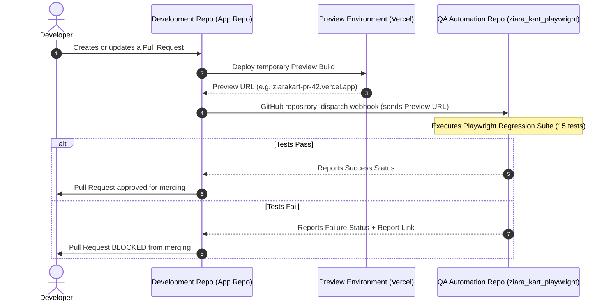

# Cross-Repository CI/CD Quality Gate Setup

This guide details how to automatically trigger the **ZiaraKart Playwright Automation Suite** from a **separate Development / Application Repository** whenever developers open a Pull Request or push code.

---

## Architecture Overview



---

## Step-by-Step Implementation

### Step 1: Create a Personal Access Token (PAT)
1. On GitHub, go to **Settings** > **Developer settings** > **Personal access tokens** > **Tokens (classic)** (or Fine-grained tokens).
2. Click **Generate new token**.
3. Set Note to: `ZiaraKart QA Automation Dispatch`.
4. Check the **`repo`** scope (or `contents:write` for fine-grained).
5. Copy the generated token string.

---

### Step 2: Add Secret to the Development / Application Repository
1. Open your **Development / Application Repository** on GitHub.
2. Go to **Settings** > **Secrets and variables** > **Actions**.
3. Click **New repository secret**.
4. Name: `QA_REPO_ACCESS_TOKEN`
5. Value: *Paste the PAT from Step 1*.
6. Click **Add secret**.

---

### Step 3: Add Trigger Workflow in the Development Repository
In the **Development Repository**, create a new file at `.github/workflows/trigger-qa-regression.yml`:

```yaml
name: Trigger Automation Quality Gate

on:
  pull_request:
    types: [opened, synchronize, reopened]
  # Or after deployment completes
  deployment_status:

jobs:
  trigger-automation:
    runs-on: ubuntu-latest
    steps:
      - name: Send Dispatch Event to Playwright QA Repo
        uses: peter-evans/repository-dispatch@v3
        with:
          token: ${{ secrets.QA_REPO_ACCESS_TOKEN }}
          repository: Aquil1401/ziara_kart_playwright
          event-type: run-regression-tests
          client-payload: >-
            {
              "target_url": "${{ github.event.deployment_status.target_url || 'https://ziarakart.vercel.app' }}",
              "pr_number": "${{ github.event.pull_request.number }}",
              "sha": "${{ github.event.pull_request.head.sha || github.sha }}"
            }
```

---

## Manual Execution with Custom URL

You can also run tests on-demand against any custom deployment or preview URL directly from GitHub Actions:

1. Go to **[Actions > Playwright Tests](https://github.com/Aquil1401/ziara_kart_playwright/actions/workflows/playwright.yml)** in this repo.
2. Click **Run workflow**.
3. Enter the custom `target_url` (e.g., `https://ziarakart-staging.vercel.app`).
4. Click the green **Run workflow** button.
