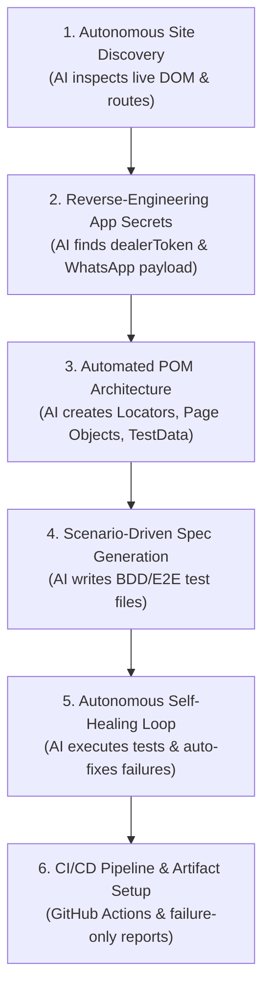

# Zero-Code AI-Driven Playwright Automation Guide

This guide explains the exact **AI-driven and MCP (Model Context Protocol)** methodology used to build this entire Playwright TypeScript framework from scratch without writing a single line of code manually.

Use this guide for YouTube tutorials, team presentations, or learning modern AI test engineering workflows.

---

## 💡 What is MCP (Model Context Protocol)?

**Model Context Protocol (MCP)** is an open standard developed by Anthropic that allows AI models (like Gemini, Claude, or local LLMs) to connect directly to external tools, databases, live browsers, and developer environments.

In test automation, **Playwright MCP** allows an AI agent to:
1. Open a real browser instance (`chromium`, `firefox`, `webkit`).
2. Navigate to target URLs (`https://ziarakart.vercel.app/`).
3. Query the accessibility tree, inspect DOM elements, and extract live locators.
4. Execute user flows (click, fill, type, scroll) in real-time.
5. Inspect application bundles, network calls, and localStorage keys.

---

## 🛠️ The 6-Step Autonomous AI Workflow

---

### Step 1: Autonomous Web Discovery
**What the AI did:**
- Instead of asking a human to inspect HTML in Chrome DevTools, the AI ran autonomous crawler scripts to inspect `https://ziarakart.vercel.app/`.
- Extracted all headings, navigation links, buttons, form inputs, and interactive components.
- Identified that ZiaraKart is a React single-page app (SPA) with routes: `/`, `/about`, `/products`, `/distributor`, `/checkout`.

### Step 2: Reverse-Engineering Business Rules
**What the AI discovered:**
1. **Wholesale Access Control**:
   - Guests see blurred prices with a **"Request Access"** button.
   - Retailers are authenticated via `localStorage.getItem("dealerToken")`.
   - When `dealerToken` is present, prices unblur and the **"Add"** buttons activate with quantity controls (`+` and `−`).
2. **WhatsApp Order Integration**:
   - The application does not use traditional credit card payment gateways.
   - When an order is placed on `/checkout`, the app compiles an encoded WhatsApp URL:
     `https://wa.me/917979720438?text=*🧾 New ZiaraKart Wholesale Order!...`
   - It triggers `window.open(url, "_blank")` and displays a confirmation view.

### Step 3: Generating Page Object Models (POM)
**What the AI generated:**
- **Locators**: Separated into [locators/](file:///g:/Playwright_Automation/ziara_kart_playwright/locators) (`header`, `products`, `cart`, `checkout`, `dealer-modal`).
- **Pages**: Built typed classes with methods:
  - `BasePage.ts`: Dynamic loading synchronization and dealer auth mocking.
  - `HomePage.ts`: Search, category selection, card actions.
  - `CartDrawer.ts`: Slide-over transition handling (`translate-x-0` vs `translate-x-full`).
  - `CheckoutPage.ts`: Intercepting `window.open` to capture the WhatsApp payload.
  - `DealerModal.ts`: Form filling and validation assertions.

### Step 4: Writing Declarative Test Suites
**What the AI created in `tests/`:**
- 15 comprehensive test cases covering:
  - Header branding & multi-page navigation.
  - Live product search & category filtering.
  - Unauthenticated guest mode & modal validations.
  - Full end-to-end dealer purchase journey with WhatsApp link validation.
  - Cart drawer edge cases (empty states, decrementing to zero).

### Step 5: The Autonomous Self-Healing Loop
When running the initial test suite, the AI automatically identified and fixed runtime issues without human intervention:

| Challenge | Root Cause Detected by AI | Autonomous Self-Healing Fix |
| :--- | :--- | :--- |
| **Category Pill Failure** | Categories were rendered in a `<select>` dropdown, not separate `<button>` pills. | Updated `HomePage.ts` to use `selectOption()`. |
| **Dynamic Loading Discrepancy** | Categories and products load asynchronously from client-side APIs. Initial counts were sampled before loading finished. | Enhanced `BasePage.ts` with `waitForProductsToLoad()` and dynamic polling until catalog is stable. |
| **Drawer Close Transition** | The cart drawer `<h2...>` stays in the DOM, but parent slides with CSS transform `translate-x-full`. | Updated `CartDrawer.ts` to wait for CSS transform classes instead of DOM detachment. |
| **Headed Mode Focus Contention** | Multiple browser windows popped up on Windows desktop, fighting for OS focus and throttling timers. | Added `workers: 1` locally, `noWaitAfter: true` on in-page buttons, and Chrome launch flags `--disable-background-timer-throttling`. |
| **WhatsApp URL Assertion** | Raw URL string included decoded spaces rather than `%20` encoded substrings. | Adjusted substring matcher in `CheckoutPage.ts` to match real runtime string. |

### Step 6: CI/CD Pipeline & Failure-Only Artifacts
- Configured [playwright.config.ts](file:///g:/Playwright_Automation/ziara_kart_playwright/playwright.config.ts) for `screenshot: 'only-on-failure'`, `video: 'retain-on-failure'`, and `trace: 'retain-on-failure'`.
- Built [.github/workflows/playwright.yml](file:///g:/Playwright_Automation/ziara_kart_playwright/.github/workflows/playwright.yml) for GitHub Actions push/PR automation.

---

## 🎬 YouTube Tutorial Talking Points

When demonstrating this workflow on your channel:
1. **Show the Problem**: Traditional automation requires hours of manual DevTools inspection, copying fragile XPaths, and debugging timing issues.
2. **Show the Prompt**: Ask the AI: *"Analyze https://ziarakart.vercel.app/, discover all user journeys, and build a full TypeScript POM Playwright framework."*
3. **Show the Live Analysis**: Show how the AI extracted hidden state (`dealerToken`, WhatsApp order URL) by inspecting the application bundle.
4. **Show Self-Healing**: Run the tests, show where the AI caught a flaky locator or timing issue, and show how the AI fixed it automatically.
5. **Show the Green Suite**: Run `npm test` or `npm run test:headed` to show all 15 tests passing smoothly.
